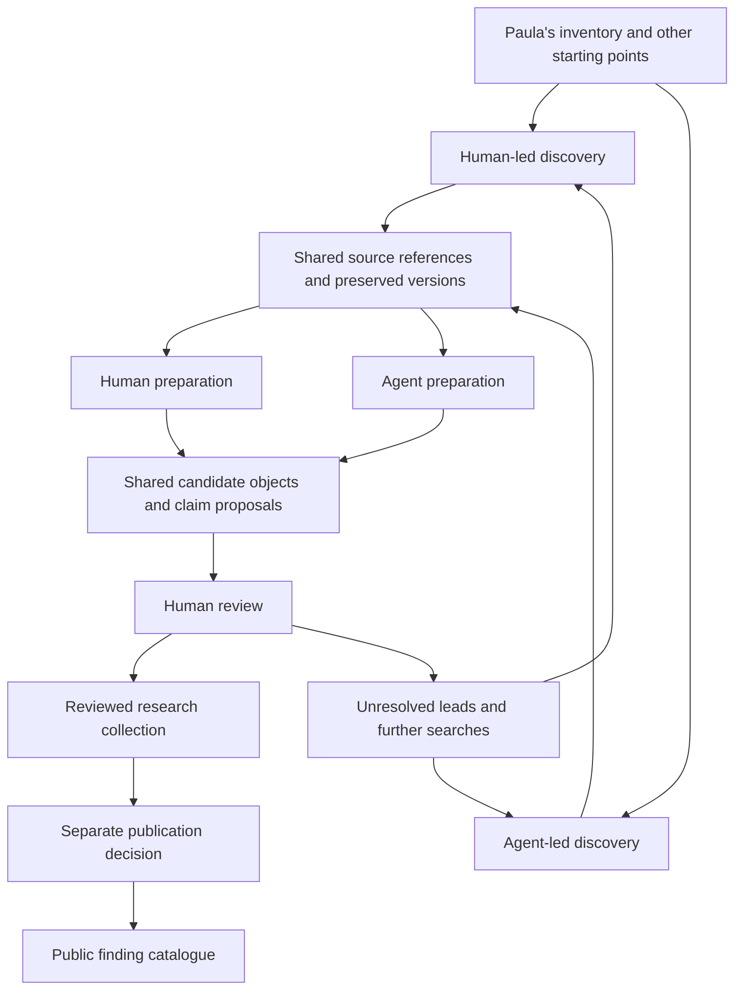

# Human and agentic discovery for the Rapa Nui collection

> Execution update (2026-09-22): discovery and preparation run in local agent or
> human research sessions. [Local research bundles](local-research.md) replace the
> hosted orchestrator and worker described in this original design. Hosted storage,
> validation, private draft review and explicit human acceptance remain. Campaigns
> and shared batch review below are future work, not implemented capabilities.

## Decision and scope

Proposed design, 22 September 2026, responding to the request to prioritise finding many more Rapa Nui objects, preserving their sources and making human review quick.

**Support human-led and agent-led discovery and preparation as two parallel, equally supported ways to bring data into the collection. People retain responsibility for identity decisions, accepting attributed claims and publication in both flows.** Build a broad, useful inventory before requiring detailed object histories.

The product should answer: **What Rapa Nui objects have been documented, where have they been reported, and how can someone find the records?** A modest record with a useful citation is valuable even when its provenance, current whereabouts or image permissions remain unresolved.

This changes the planned sequence in [the collection workflow](collection-workflow.md): add agentic discovery alongside human research, with shared source preservation, preparation and review capabilities. Develop the existing human capture route as a primary contribution flow. Human discovery and preparation must work independently of AI availability or use. The existing sign-in and publication checks remain necessary for releasing affected features; they do not need to block private discovery development.

This is a design, not an executed import or approval to publish Paula's data. Existing deployment status and operational instructions remain in the [implementation plan](collection-workflow-implementation-plan.md) and runbooks.

## The original document and its CSV derivative

The project owner clarified that `arte-escultura_-_museos-1.pdf` is the original document and that they made `rapa-nui-data-from-paula(4).csv` to make searching easier. Preserve the PDF as the primary artefact of this compilation and the CSV as a user-created derivative. They are one evidence lineage, not two independent accounts. This does not make the compilation an original museum catalogue or establish its historical assertions as fact.

The PDF has 19 pages. Its museum inventory begins on page 12 and continues through page 19; page numbers here are one-based PDF page positions. All eight inventory pages were visually inspected. The preceding discussion remains part of the preserved document and can supply separately attributed context, but general descriptions of object types must not automatically become claims about every listed object. The original PDF is 227,373 bytes; SHA-256: `f2a2da032fb4454a93d38796d3cd186a772598409ef96ba00d19ad39d1ce2d7b`.

The CSV was inspected read-only. Counts below describe parsed CSV records, including quoted multiline cells, rather than physical lines or reconciled PDF entries.

| Observation | Consequence |
| --- | --- |
| 179 data rows and four columns: `MUSEO-COLECCIÓN`, `LUGAR`, `OBJETO`, `Notes` | Preserve every derivative row and reconcile it to the original PDF before creating logical inventory entries. |
| 172 rows contain object wording; seven have an empty `OBJETO` | These are transcription counts, not 172 distinct object/group leads. At least one description is split into two CSV rows across a PDF page break. The seven institution-only entries have genuinely empty object cells in the final PDF section. |
| 60 distinct museum/collection labels; 63 distinct label–location pairs | These are search inputs, not a verified count of distinct institutions. Resolve institutions with their locations and history. |
| No URLs or dedicated accession-number column | Most matches need discovery and human identity review. Numbers embedded in descriptions include dimensions and quantities. |
| Eight rows have notes about institutions listed in a Heyerdahl publication for which photographs were not found | The PDF presents this as one section note on page 19. Preserve its scope and link the affected entries to it; do not treat the CSV repetitions as eight independent statements. It is neither evidence of absence nor a verified citation to an inspected book. |
| An identical `Tahonga` row appears twice for the same Oslo institution | Preserve both observations. The repetition could represent two objects or a duplicate entry. |
| Some entries describe pairs, plural objects or whole collections | One row can lead to several objects; several rows can eventually refer to one object. Do not manufacture individual identities from a quantity. |
| Historical institution/place names, uneven spacing and spelling variants occur | Retain the original wording alongside proposed search aliases. Do not silently modernise the source. |
| A private postal address appears in the file | Keep the original private; omit personal addresses from agent search payloads and public exports. |

The CSV bytes are not valid UTF-8. CP850 produces plausible accented text, including the header and German institution names. Record CP850 as the proposed decoding, retain the untouched derivative, and compare representative accented cells with the PDF before accepting that decoding. The CSV is 14,531 bytes; SHA-256: `efede34fda650443e0748c8c3e0808d5deca48d0bca2dd7fdd522c040165eb06`.

Record the compilation's author/compiler credit when confirmed, the PDF contributor, the project owner as CSV derivative creator, document date if known, transformation date if known, upload times and access permissions separately. Do not identify the compiler as a museum speaker or date the assertions to the upload date. Preserve PDF-to-CSV lineage as ingestion metadata, without inventing a domain predicate. Do not commit either file or a bulk transcription to Git.

### Blank cells, continuations and transcription reconciliation

The project owner confirms that blanks mostly mean “same as above”. Apply that convention to the table's structure, not indiscriminately to every empty cell:

1. Retain each cell's literal contents, including blanks, and its PDF page, table region and bounding box. Keep interpreted values separately, with a status such as `explicit`, `inherited`, `not specified` or `ambiguous`.
2. Within an established institution block, inherit the museum/collection and location for subsequent object entries. Each inherited field points to the explicit source cell from which it comes and records the interpretation rule. The review pane shows both the object wording and the institution/location context.
3. Carry context across a page break only when the table visibly continues the same block. For example, the first inventory row on page 13 continues the Berlin block from page 12, and the first three entries on page 16 continue the Oslo block from page 15. A page break alone neither resets context nor establishes a new object.
4. A new institution resets institution-specific context. A blank location beside a new institution stays unresolved unless the layout establishes a shared location. For example, the blank location for `Museo del Trocadera` on page 19 must not acquire Copenhagen from the preceding entry.
5. Distinguish table headers, regional headings, section notes and empty spacer rows from inventory entries. They do not create candidates or supply literal place values. A new section ends the previous institution block; repeated headers alone require a continuation check.
6. Do not fill an empty object cell with the previous object's description by default. The seven institution-only entries on page 19 remain institution leads. An unclear object-cell continuation goes to review.
7. Join a description split across pages into one logical observation, while retaining every contributing region and CSV row. On pages 17–18, the description of a 23 cm stone continues with `hombre pajaro`. CSV records 147 and 148, counting the header as record 1, split that description; they must not generate two object leads. This confirms one transcription artefact, not a complete row-by-row reconciliation.
8. Preserve source anomalies separately from transcription errors. Explicit wording in the PDF, such as the Ulster Museum row's Berlin location, must not be silently “corrected” by inheritance or geographical assumptions. A researched correction becomes a separate proposal with its own evidence.

Import the 179 CSV rows without loss, then map them to logical PDF entries using potentially many-to-many links. Preserve proposed joins, disagreements, omissions and additions in a reconciliation report for review. Corrected derivatives get a new version; the supplied CSV remains unchanged. Recompute lead totals after reconciliation, and keep raw row counts separate from logical entries and distinct objects.

### Two uses of the same source

1. **Direct evidence:** reviewers can accept what the original compilation records, attributed to the compilation and cited to the PDF regions, including inherited context. The CSV helps locate entries. A museum match is not a prerequisite for preserving or reviewing this account.
2. **Discovery seeds:** researchers and agents use reconciled institution, locality and object wording to find catalogues, publications and other accounts. A found museum record is a new source with its own attribution. It does not replace the compilation.

For a direct compilation import, a specific object can enter the research collection once a reviewer can reasonably distinguish its identity. Vague groups and institution-only entries remain searchable leads. An institution named in a row, explicitly or through an established continuation, is a reported association at an unknown date unless the source establishes custody more precisely; it is not automatically the current holder.

## The product model

Maintain three connected collections:

| Collection | What it contains | Who can see it |
| --- | --- | --- |
| Discovery workspace | Seeds, institution leads, captured sources, candidate objects, proposed claims, unresolved matches and unsuccessful searches | Authorised research collaborators |
| Reviewed research collection | Explicitly identified items and accepted, attributed claims with evidence; incomplete dossiers are welcome | Existing research access rules, extended deliberately where needed |
| Public finding catalogue | Approved portions of reviewed records, with citations and uncertainty visible | Community and public |

Count source records, candidates, distinct reviewed objects and published objects separately. A thousand captured pages must never become a claim to have found a thousand distinct objects.

The discovery workspace is immediately useful to the team. The public catalogue is a first delivery outcome too: collecting indefinitely behind a private review backlog would not fulfil the community purpose.

### Two contribution flows, one research system

| Stage | Human-led flow | Agent-led flow | Shared result |
| --- | --- | --- | --- |
| Discovery | A person searches catalogues, follows references, conducts archival or community research, or contributes an existing document | An agent searches and follows leads within an authorised campaign | Addressable leads and source references |
| Preservation | A person adds a URL, uploads a document or photograph, or records an archival reference; the system preserves available material | A worker retrieves permitted material and records its capture | The same versioned sources, access rules and evidence locators |
| Preparation | A person transcribes, reconciles tables, selects evidence, proposes identities and maps statements into the ontology | An agent proposes the same kinds of records with its extraction and mapping history | The same revisioned candidates, claims and unresolved observations |
| Review and import | An authorised person reviews the prepared revision and explicitly accepts supported content | An authorised person reviews the agent-prepared revision and explicitly accepts supported content | The same validated canonical import and acceptance history |

Provide **Add source**, **Prepare record** and **Run discovery campaign** as primary actions. People can add individual records or prepare batches from documents without starting a campaign or invoking a model. Reference-only archival material remains usable with an honest locator and preservation status. Source capture services may assist either flow without making human preparation dependent on AI.

Researchers can complete discovery and preparation themselves, request optional AI assistance for a particular step, or continue from an agent's work. Agents can start from a human-discovered source; humans can prepare a record from an agent-discovered source. Hand-offs reuse source and candidate identities, retaining edits and unresolved questions rather than copying content into separate catalogues.

Record who discovered, captured, prepared, edited and reviewed each revision, with method and model/run details only where applicable. A human revision does not erase an earlier machine contribution, and machine assistance does not make the model the source's asserting agent. Attribution to the source remains separate from contribution history.

Apply the same evidence, identity and publication requirements to both flows. Human preparation does not implicitly accept a claim, and agent preparation does not imply inferior or superior evidence. A person with the relevant permissions may prepare and then explicitly review their own record; this design does not introduce a mandatory second-person approval rule. Publication remains a separate decision.

## Discovery that expands beyond the spreadsheet

The three discovery routes below support both human research and autonomous discovery. Shared campaigns can organise either or both; individual human contributions do not require campaign membership unless their access scope requires it.

### Agent campaigns and bounded jobs

A researcher starts a campaign such as **Find Rapa Nui holdings using Paula's inventory**. The campaign specifies its seeds, source scope, permitted processing, request/model-cost ceilings, time limit and assigned reviewers. The interface offers Start, Pause, Resume and Review results.

The agent chooses search terms, follows relevant links, proposes institutional successors, inspects results and schedules useful follow-ups within that scope. Execution uses explicit jobs with saved progress, not one unbounded conversation. Each job returns sources, candidates, unresolved questions and its stopping reason.

Use one orchestrator and a small worker pool initially. Discovery, extraction and matching are distinct stages with structured outputs; they do not require separate conversational agents or a new orchestration platform.

### Three discovery routes

| Route | Behaviour | Why it matters |
| --- | --- | --- |
| Seed matching | Search the institution and descriptive clues for each reconciled inventory observation | Connects the compilation to identifiable records. |
| Collection expansion | Once a relevant catalogue is found, search its wider Rapa Nui holdings and enumerate permitted results | Finds objects absent from the spreadsheet. |
| Citation and institution expansion | Follow referenced catalogues, collection histories, accession aliases, institutions and publications | Reaches historical, transferred and poorly indexed holdings. |

Start with source-provided terms and controlled search expansions: Rapa Nui, Easter Island, Isla de Pascua and relevant local-language terms, plus object words and spelling variants. Search aliases are retrieval aids, not accepted translations or ontology equivalences. Preserve who approved curated terminology.

Prefer a documented API or downloadable catalogue where available, then structured catalogue pages, then browser capture and document extraction. Use broad web search to discover sources. A search snippet creates a lead; it does not establish a museum assertion or a successful source capture.

This is practicable with existing sources. [Te Papa documents collection search with pagination](https://data.tepapa.govt.nz/docs/resource_SearchResource.html) and [API access](https://www.tepapa.govt.nz/collections-api-new). The [Smithsonian describes API and bulk JSON access](https://www.si.edu/openaccess/devtools). These are candidate adapters, not integrations already tested in MoSA. Confirm credentials, permitted use and actual coverage during the pilot.

Do not let the easiest API dominate the collection. Allocate campaign work across institutions, regions, languages and source types, with a dedicated allowance for new institutions and difficult leads. Include permitted community accounts and local research as sources; museum catalogues are particularly useful for institutional identifiers, not automatically authoritative for every claim.

### Stopping and retrying

Each job has finite page, request, model-token/cost and elapsed-time budgets. Stop at the first exhausted limit, a completed search or a stable run of already-seen results. Save pagination cursors and discovered links. Honour host rate limits and back off after failures.

Record distinct outcomes: results found, no match in this search, ambiguous match, source unavailable, access restricted, parsing failed and budget exhausted. None means that an object does not exist. Failure in one institution does not stop the campaign. Pause acquisition when the review queue exceeds the team's configured capacity.

## Preserve sources before interpreting them

The requested “fixtures” should be **immutable research source captures**. Keep that term distinct from `supabase/fixtures`, which contains synthetic, destructive-reload test data and must not become the production collection.

Every successful capture has a manifest and preserved content:

| Part | Required contents |
| --- | --- |
| Source identity | Original reference, publisher if established, source kind, upstream record ID if available |
| Retrieval | Requested and final URL, retrieval time, response status, relevant response headers, acquisition method and discovered-from links |
| Original artefact | Exact response body, original PDF/image or uploaded CSV, media type, byte count and content hash |
| Readable derivative | Extracted text or structured fields, parsing/OCR version, parent artefact hash and stable locators |
| Dynamic-page evidence | Rendered content and screenshot when needed; distinguish these from the original HTTP response |
| Access and use | Storage visibility, permission for external-model processing, metadata/media rights separately, restrictions and their basis |
| Contribution and execution | Responsible contributor/service and method; campaign, job and attempt IDs for automated work; extraction model, prompt, parser and ontology versions where applicable. Human uploads and preparation require no model run. |

Content goes in private object storage. The database stores its manifest and references. A hash can deduplicate bytes, but it must not collapse different sources, retrieval histories or access permissions. Shared blob storage needs reference-aware deletion and permission checks.

A capture is successful only after its bytes are stored and hash-checked. An HTTP 200 login page, empty JavaScript shell or bot challenge is not a captured catalogue record. Store failed attempts as failures. Keep restricted or undownloadable references usable as leads without claiming to have archived them.

For CSV evidence, retain the supplied file's hash, parsing/encoding version, parsed record ordinal, column name and original cell value. Quoted newlines mean that an ordinal is not a physical file line. For PDFs use page and region; for JSON use a field pointer; for HTML use a source-version-specific field or text span. Preserve OCR uncertainty rather than presenting OCR as an exact transcription. For this compilation, claims cite the original PDF and retain the CSV reconciliation link. An inherited field references both the target row and the earlier context cell; a description spanning pages references both regions. Neither an inherited value nor a repaired transcription is presented as literal text printed in the blank cell.

A later fetch creates a new version. Existing evidence stays attached to the version the reviewer saw. Changed sources generate proposed updates and a diff; they never silently rewrite accepted claims. Re-extract stored content without fetching again when only the prompt or parser changes. Deletion required by an authorised access decision removes affected content and derivatives, retaining only a permitted audit tombstone.

## Extraction and ontology mapping

Use two steps: extract **what this source says**, then propose **how MoSA can represent it**. Keep source wording, translation, machine interpretation and reviewer correction distinguishable.

Both steps can be performed by a person or an agent. The human preparation interface supports direct transcription, evidence selection, table reconciliation and claim mapping without a generated proposal being required first.

A proposal includes the candidate subject, predicate/value, original wording, asserting agent or explicitly unknown attribution, source version or explicit reference-only status, locator, evidence relationship, preparer and method, and mapping explanation. Record an extraction run when one exists. It also records whether the statement concerns a present state, an historical state or an undated association. Model confidence may help triage; it is not evidence or a publication criterion.

Use the existing [predicate meanings](predicates.md). Mapping can return `mapped`, `ambiguous`, `unsupported` or `needs identity`. Unmapped observations remain visible and searchable. A useful candidate must survive a failed mapping.

| Source observation | Proposed treatment |
| --- | --- |
| Explicit object title | `has_name`, with original wording and attribution |
| An object-type field | `classified_as`; do not relabel a type as a name to satisfy a form |
| A descriptive sentence or spreadsheet description | `described_as`, or several narrowly supported proposals |
| Explicit current custody | `held_by`; neither catalogue publication nor ownership wording alone establishes custody |
| A locality beside an institution in the spreadsheet | Discovery context; not automatically the object's present location or place of manufacture |
| Explicit production, findspot or removal place | Respect `made_at`, `found_at` and movement-event distinctions |
| Material or dimensions | Preserve the observation; map only through a supported, validated contract |
| A pair or collection | A group lead until individual identities are evidenced; do not create guessed accession numbers |
| Qualified or conflicting account | Preserve wording and appropriate evidence relationship; do not resolve disagreement by majority vote |

The ontology already knows more than the importer can write. Packet v2 accepts seven summary predicates; it does not support the full provenance model, structured dates, materials or dimensions. Extend supported writes through concrete source cases. Agents must not create predicates, Concept entities or database migrations in response to a mapping failure.

Maintain a small mapping-gap queue with the original observation and the user question that the gap prevents us answering. Resolve recurring gaps deliberately. Do not make a general ontology editor a prerequisite for collecting objects.

### A concrete example

Te Papa's [Moai Kavakava record FE010507](https://collections.tepapa.govt.nz/object/206768) provides a title, production field, classification, materials and a credit line describing an exchange from Otago Museum in 1937. It also marks the image as all rights reserved.

The first pass can propose supported summary claims and a catalogue identifier. Materials remain preserved if the importer cannot yet accept them. The exchange is a provenance proposal requiring the event write contract; it must not be converted into a manufacture date, proof of consent or a complete ownership history. The image is not automatically publishable. Finding this record does not establish that it matches a particular generic spreadsheet row.

## Identity without losing objects or multiplying them

Keep separate identities for a seed observation, a source record, a candidate object and a canonical item. Model their links explicitly, including many-to-many seed/candidate links and a link reason such as possible match, confirmed match or discovered during expansion.

Use catalogue namespace plus accession value, verified upstream identifiers and existing bindings as strong matching signals. Preserve exact original identifier strings. Names, image resemblance and a shared institution only generate possible matches. A catalogue URL identifies a source record and can describe several objects.

The agent may propose that a historical institution label corresponds to a present institution or successor, with evidence. Review that mapping once and reuse it for search. A succession or spelling change is not automatically institutional identity, continuous custody or permission to merge collections. Never merge all occurrences of a generic museum name across cities.

Identity review offers: link an existing item, create a distinct item, split an evidenced group, retain a group lead, or defer. For high-quality exact identifier matches, preselect the existing item and show why; the reviewer still confirms the candidate revision. Before acceptance, rerun collision checks against the current database.

Repeated extraction must not create repeated claims. Use stable observation/proposal keys and versioned revisions. Reuse an already accepted claim when the attributed assertion is the same and deliberately add new evidence; preserve genuinely different assertions separately. A mirror or aggregator copying one museum record is not independent corroboration.

## Review designed for throughput

Review should be a prepared decision, not another data-entry exercise.

The main review screen is a shared queue of human-prepared, agent-prepared and jointly prepared candidates, grouped by source/institution and sorted by readiness and project priority. Each row shows the proposed label or classification, reported institution, identifier, source count, identity basis and issues. The detail pane keeps the preserved source and highlighted evidence beside the proposed record. Contribution history is inspectable without using the preparation method as a credibility ranking.

Provide three views: **Ready to review**, **Needs investigation** and **Changed sources**. These are work queues, not global credibility scores. Keep a route to all discoveries, including sources whose extraction failed.

For each candidate, the reviewer can:

1. Confirm identity or defer it.
2. Accept the supported basic record, editing or excluding individual proposals as needed.
3. Leave richer provenance, translations and uncertain fields for later.
4. Reject an irrelevant result with a reason, or assign a targeted follow-up to a person or an authorised agent campaign.

The minimum reviewed object needs a distinct identity decision, source-supported relevance to this collection, and at least one useful, attributed description/classification/name with addressable evidence. Current holder, accession number, image and provenance history can be missing. If the source supports only an unspecified group, keep it as a group lead.

Show plain-language reasons for exceptions: “Two records share this number”, “This page describes several objects”, “The source gives no current holder” or “This statement has no preserved evidence”. Do not hide the decision behind an unexplained percentage.

Batch acceptance is explicit selection of displayed candidates and their basic proposals. It records a decision for every selected candidate revision, not approval of an institution or future crawler output. Start with small batches, such as 10–20 records; allow keyboard navigation and one-step acceptance after inspection. Do not preselect uncertain claims. Institutional name/namespace decisions can be reused without separately retyping them for every object.

Edits invalidate review. A stale revision cannot be accepted. Each candidate acceptance is transactional and idempotent; a partially completed batch reports item-level outcomes and resumes safely. Competing reviewers use revision checks and short review assignments. Corrections preserve the accepted revision and an audit trail, and create an explicit superseding/withdrawal operation rather than overwriting history.

A second machine pass may check whether quotations exist and mappings obey rules, but it cannot substitute for human acceptance. Every canonical candidate receives human review. Sample-based audits are an additional quality check, not the sole approval mechanism.

## Architecture in this repository

Keep the existing Astro research app, Supabase database, shared importer and static publication boundary. Add one background worker deployment for discovery/capture/extraction. Do not perform lengthy research inside web requests or give a model database administration access.

Proposed logical records below are additive design responsibilities, not final migration names:

| Record | Purpose |
| --- | --- |
| Campaign and membership | Scope, budgets, contributors, reviewers, shared access and progress |
| Seed observation | Immutable source row or reference, optional normalised search fields, linked candidates |
| Discovery job and attempts | Queue state, leases, retries, parent job, checkpoints and cost |
| Source capture/version | Preserved artefacts, access policy, retrieval history and derivatives |
| Candidate and revisions | Provisional identity, contributing sources, group/single/unknown granularity |
| Claim proposal | Human- or machine-prepared observation, mapping status, evidence and revisioned changes with contributor/method history |
| Identity/review decision | Actor, scope, revision, outcome, explanation and canonical acceptance references |

Use a Postgres job queue initially, with short transactional job leases and expiry/retry recovery. Commit the lease before network/model work. Object storage and database writes need a recoverable finalisation step because they cannot share one transaction. Use idempotency keys for uploads, attempts, proposal creation and acceptance. Index queue eligibility, campaign membership and candidate/review lookups. Heavy content remains outside database rows.

The existing capture drafts are author-private and accept one bounded proposal at a time. They cannot simply be filled by an agent and become a shared review inbox. Add campaign-level access and membership explicitly, keep existing private drafts private, and allow authorised submission into a campaign. Enforce access in database policies and storage, not only in the interface. Restricted material must not become visible merely because it joins a campaign.

### Reuse and extend the write boundary

- Keep `packages/object-dossier/` as the canonical write implementation. Human preparation and workers write the same staging contracts; a trusted acceptance operation compiles the exact human-reviewed revision into a validated packet. Human submissions require neither a model run nor an autonomous campaign.
- Introduce a versioned packet extension for uploaded sources and immutable evidence-version references. An internal source reference must be a real resolvable reference, not a fabricated public URL inserted to satisfy v2.
- Preserve v1/v2 checksums and replay behaviour. Older URL-only evidence remains explicitly unarchived; a new capture cannot retrospectively prove what the page said when an old claim was accepted.
- Keep dataset bindings stable across revisions. Use database constraints and transactional checks to handle simultaneous discoveries of the same identifier, beyond the existing per-dataset lock.
- Add deliberate support for selected existing agent/place identities and attaching evidence to existing claims. Do not bypass identity checks through handcrafted SQL or silently create a new institution per object.
- Link reviewed source versions into canonical evidence on acceptance. Manual submissions and agent proposals share those validation rules.
- Add correction operations with explicit privileges. Current accepted drafts are immutable and the capture writer cannot update existing canonical claims; correction is real work, not a UI-only change.

### Agent boundaries

The worker can search approved public sources, retrieve through a constrained fetch service, inspect authorised captures and propose records. It cannot accept claims, change the ontology, publish, contact institutions or alter permissions.

Page text, PDFs and spreadsheet cells are untrusted data. Embedded instructions cannot change the campaign or authorise tools. The fetch service blocks private/local network targets, revalidates redirects and limits download sizes. Serve archived HTML inertly. Keep API credentials out of model context and stored response metadata.

Private-source processing follows its explicit permissions; default to sending agents only the necessary redacted seed fields. Separate permission to preserve a source, send it to a model and publish its contents. Sensitive discoveries can be routed to a restricted review queue without exposing their content or counts to unauthorised users. A machine flag is a request for assessment, not a declaration of cultural authority.

## A public catalogue useful to the community

Replace the two-card pilot constraint with a versioned public contract for a scalable finding catalogue. A record can use a reviewed description or classification as its display label without turning that wording into a `has_name` claim. The exported label retains its basis and attribution.

Publish, where approved: stable MoSA reference, label, cited source records, institution association or reported holder with its temporal qualification, institutional identifiers when known, source-check date and clear gaps. Do not use the retrieval date as the date of custody. Render missing information honestly: “Current holder not established” is preferable to a guessed holder.

Allow a reviewed compilation-only record when it identifies a distinct object and its relevant citation/content is authorised. Cite the original PDF, with the CSV retained as its search derivative. If the file is private, publish only the approved citation metadata and wording, not its storage URL. No minimum number of museum sources is required. Unresolved groups and institution leads can later have a separately labelled public research-leads view; they must not inflate the object count.

Offer search and filters based on approved fields, stable shareable object pages, source links and a downloadable authorised index. Keep a route for community corrections through the existing contact process. Retain original wording and distinguish reviewed translations; missing translations or images must not block an otherwise useful record.

Publication remains a separate revision-specific decision. The same reviewer may prepare a public batch during review, but sees and approves a distinct public preview. Accepting research does not authorise publication. Extend the exporter, ledger operations, website and tests together; removing the parser's two-record limit alone is insufficient. Reuse the existing withdrawal gate and verify individual removal from pages, search and downloads at collection scale.

## Delivery sequence

The [implementation and commit plan](collection-workflow-implementation-plan.md) is the single current delivery checklist. It divides this design into twelve narrow vertical slices, each with a working user task, dependencies, acceptance checks and a lower-case scoped Conventional Commit. The earlier four broad delivery stages are replaced by that sequence.

The first releases make document preservation and human document-backed entry usable, then add saved web sources, optional AI preparation and discovery from one lead. Both complete contribution flows work by slice 5. Inventory reconciliation, campaign sharing and batch review extend those working paths. Corrections and expanded publication can proceed after document-backed entry without waiting for campaign or batch features.

Treat cohort sizes as evaluation and planning targets, not prerequisites for every small release: evaluate approximately 30 candidates across varied institution contexts, then work towards 50–100 distinct reviewed objects if the evidence supports them. Demonstrate useful incomplete records and individual withdrawal when the public contract expands. Never lower identity or evidence requirements to reach a count.

## Success measures and release checks

The main measure is **new, distinct, useful objects reviewed per hour of human work**, alongside the number actually made available to the community. Include human discovery and preparation time, not only final review time. Track median and slower-case review times, correction rates, acceptance rates, discovery/model cost per accepted object, institution/source diversity and unresolved backlog age. Inspect human-led, agent-led and mixed contributions separately to improve each flow, accounting for task difficulty rather than treating throughput as a ranking of researchers. Set numerical operating targets after the first measured cohort; model confidence and raw page totals are not substitutes.

Keep a small reviewer-adjudicated evaluation set of clear, ambiguous and negative cases. Check identity decisions, exact evidence support, attribution and predicate semantics separately. Evaluate retrieval coverage against known catalogue result sets where possible; the global number of Rapa Nui objects is not a known recall denominator. When prompts or parsers change, replay stored captures against this set before expanding their use.

Release checks must demonstrate:

- Human discovery, capture, preparation, review and import work with AI disabled and without an autonomous campaign. Agent-prepared work uses the same evidence and import validation.
- Human/agent hand-offs preserve source identities, candidate revisions, edits and contribution history. Neither preparation route bypasses explicit human acceptance or publication decisions.
- PDF/CSV lineage and decoding preserve all 179 derivative rows with exact source locators. Reviewable reconciliation joins the page 17–18 split description, preserves distinct repeated entries and groups, and reports logical-entry counts separately.
- Inherited institution/location fields retain their donor-cell locators across demonstrated table continuations. New institution/section boundaries prevent accidental carry-over; the seven institution-only entries keep empty object values. PDF and CSV never count as independent corroboration.
- A captured source can be inspected after the upstream page changes or disappears; each accepted assertion still points to the reviewed version.
- A source can fail to fit the ontology without being lost; contradictory claims retain separate attribution.
- A shared catalogue URL and similar names do not silently merge distinct objects; simultaneous jobs cannot duplicate an exact canonical identifier.
- Agents cannot accept or publish; embedded source instructions cannot authorise actions; private material stays out of public search, exports and agent payloads without permission.
- Stale reviews fail safely; retries, partial batches and worker crashes preserve completed work without double acceptance.
- Acceptance, correction and publication remain distinct; withdrawal removes the affected public content without restoring it through a stale export.

The intended result is a growing, source-backed inventory that people can use now, with a clear path from each discovery to its evidence and from each accepted account to the person who reviewed it.
