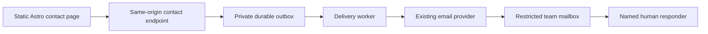

# Conecta con MoSA: contact service design

Status: deferred alternative, not implemented. Sources checked on 2026-09-13.

[ADR 015](adrs/015-use-email-for-public-contact.md) selects email-only contact and
supersedes this document's form-first recommendation. This document preserves
the alternative design for reconsideration if a demonstrated need emerges.
Its proposed service commitments and retention periods are not adopted policy.

## Original proposal

Make contact the start of a private conversation with a person. Provide a short form and a visible, copyable project email address. Keep the public Astro website static. Use a separate contact intake service to accept messages reliably and deliver them to a restricted team mailbox.

The first release serves ordinary enquiries, collaboration, corrections and requests to discuss restitution. It does not collect research dossiers, establish cultural authority or grant permission to publish. A conversation can lead to a separate, agreed process for sharing material.

Assumption: message volume is low and a small team will answer through email. The mailbox provider, accountable organisation and staff availability have not been established from the repository.

## Visitor experience

Retain the existing visual identity. Use one form column with persistent labels, ample spacing and a clear submission button. Place the direct email option above the form so visitors can find it even when the form service fails. Render the form before decorative artwork on narrow screens.

| Field | Required | Behaviour |
| --- | --- | --- |
| Reply email | Yes | Explain that MoSA uses this address to reply. Allow paste and autocomplete. |
| Message | Yes | Invite a short introduction; show the length limit before submission. |
| Preferred name | No | Accept a chosen name without requiring a legal identity. |
| Topic | No | Offer restitution/reconnection, collection information or corrections, collaboration, press, and another topic. Default to no selection. |

Remove the separate subject field. Generate the internal email subject from the topic and a random receipt identifier. Do not require an organisation, phone number, location, account or evidence of community membership. Do not add attachments in the first release.

Use reviewed Chilean Spanish and British English messages when those site languages are available. Allow messages in Rapa Nui, retain the original text, and arrange human language support without promising immediate fluency. Do not infer a person's language from their name or nationality. Keep interface locale and message language separate.

Draft interface copy for editorial review:

> **Conecta con MoSA**
>
> ¿Quieres conversar sobre restitución, compartir información o colaborar? Cuéntanos brevemente. No necesitas representar a una institución.
>
> **¿Cómo te gustaría que te llamemos?** — Opcional
>
> **Correo para responderte**
>
> **¿De qué te gustaría conversar?** — Opcional
>
> **Tu mensaje**
>
> Para comenzar, basta una descripción general. Si quieres compartir información sensible o conocimientos de acceso restringido, podemos acordar primero cómo hacerlo.
>
> **Enviar mensaje**

Place a concise privacy explanation beside the button, linked to the complete notice. Identify who receives the message and explain that sending it does not authorise publication. The draft is not a complete privacy notice.

Publish a response target only after the team agrees to staff it. Proposed target: a first human response within 5 working days. Explain that this is a first response, not a promise to resolve a restitution request within that period. State the team's working calendar where the target is published. Show planned absences.

## Accessibility and failure behaviour

Use an ordinary HTML POST with optional JavaScript enhancement. The ordinary submission path works without JavaScript. Return accessible HTML for that path; JavaScript can request structured responses and preserve the current page.

Use visible labels, explicit required/optional indicators, appropriate autocomplete and semantic buttons. Show a linked error summary and field-specific errors. Move focus to the error summary after an enhanced submission fails. Preserve entered text on validation errors; do not persist drafts in local storage by default. Announce pending and final submission states without relying on colour. These choices follow [W3C guidance on form notifications](https://www.w3.org/WAI/tutorials/forms/notifications/) and [labels and instructions](https://www.w3.org/WAI/WCAG21/Understanding/labels-or-instructions).

| Condition | Visitor outcome |
| --- | --- |
| Message durably accepted | Show a receipt identifier and the response target. Say that MoSA received the message; do not claim that a person has read it. |
| Invalid input | Identify the affected fields and preserve the draft in the returned form. |
| Intake cannot save the message | Show a temporary failure and the direct email option. Do not display success. |
| Network timeout with uncertain outcome | Explain that receipt could not be confirmed. Preserve the enhanced form draft and retry with the same submission key. |
| Repeated click or retried request | Reuse the receipt for the same submission key and payload. Reject reuse with a different payload. |
| Rate limit | Explain when to retry and keep the direct email option visible. |
| Email delivery delayed after acceptance | Retain the accepted message, retry delivery and alert the operator. The visitor does not need to resubmit. |

For no-JavaScript network failures, the browser controls the error page and may not retain the form. Keep the direct email address visible on the original page and do not claim that every network failure preserves a draft.

Use a success page that contains no message body, email address or name in its URL. Receipt identifiers are references, not credentials for a public message lookup. Avoid an automatic acknowledgement email initially: the browser receipt is sufficient, and an unverified address could otherwise be used to send unsolicited mail to someone else.

## Delivery architecture

Recommended deployment for the current repository:

Route the endpoint to a small independent service through the website's reverse proxy. Reuse Coolify rather than introducing another hosting platform solely for this form. The contact service receives no explorer credentials and has no access to the collection database. A separate persistent store holds the outbox. A single-instance service can use SQLite on a persistent volume; replication is not a first-release requirement. Confirm volume durability, backup protection and recovery before launch.

Persist the accepted message and delivery state atomically before returning success. Generate a random receipt and store a client submission key for retries. The no-JavaScript form can obtain a per-request key through a small same-origin form fragment rendered by the service; do not bake a shared key into the static build. If this adds disproportionate complexity, server-render only the contact form/page in the independent service while retaining the static site elsewhere.

The worker sends to a fixed, server-configured team mailbox. Use a verified MoSA sender and the validated visitor address as Reply-To. Use structured email fields and plain text, or contextually escaped HTML. Authenticate the sending domain and test actual receipt and replies with the selected provider. Never use a visitor-controlled recipient or From address.

Delivery is at least once: a crash after the provider accepts an email can produce a duplicate. Prefer provider idempotency where supported and include the stable receipt in every retry. Do not promise exactly-once email delivery. Track queued, provider-accepted, delivered when supported, and failed states separately. Monitor bounces and provider failures. A successful API call does not prove inbox delivery.

Use existing mailbox delivery infrastructure if it meets the requirements. A managed form service is a reasonable substitute when nobody will maintain the contact service. Select one only after checking durable submission storage, exports, deletion controls, processor terms, international transfers, accessible HTML submission, retry behaviour and spam handling. Prefer that managed option over an unmaintained custom service. An EU hosting label alone does not establish adequate privacy or cultural governance.

## Abuse prevention and data handling

Validate input on the server. Proposed initial limits: a 32 KiB request body, 200 Unicode code points for a preferred name, 254 UTF-8 bytes for an email address compatible with the selected delivery provider, and 5,000 Unicode code points for a message. Keep a documented route for addresses the provider cannot support. Reject unsupported topics and payload types. Preserve accents, apostrophes and original wording; do not restrict names or messages to ASCII. Render submitted text as data, not markup. See [OWASP input validation guidance](https://cheatsheetseries.owasp.org/Input_Validation_Cheat_Sheet.html).

Start with request limits, modest rate limits and a honeypot excluded from keyboard navigation, assistive technology and autofill. Treat timing as a signal, not a reason by itself to reject a fast submission. Account for people sharing an IP address. Origin checks can reduce cross-site abuse but are not bot authentication. Do not fetch user-submitted links automatically.

Introduce a third-party challenge only if measured abuse justifies it. If Turnstile is selected, enforce the challenge on the server, validate its token and provide a direct email fallback for blocked scripts or inaccessible challenges. Cloudflare requires [server-side validation](https://developers.cloudflare.com/turnstile/get-started/). Review the processor implications before enabling it. Keep the ordinary form free of third-party challenge scripts at launch.

Exclude message bodies, names and email addresses from access logs, error reporting, analytics and URLs. Use no session replay or advertising trackers on the form. Disable request-body capture in the proxy and monitoring tools. Protect stored messages and backups, restrict service credentials and use individual staff accounts with multi-factor authentication for the mailbox.

## Human ownership and cultural authority

Assign a primary inbox steward and a backup before launch. The steward checks new enquiries on each staffed working day, assigns a responder and tracks new, assigned, waiting and closed conversations using mailbox labels or equivalent shared-inbox features. A generic distribution list alone does not assign responsibility.

The steward handles correction and removal requests as explicit topics for review. Restrict access to unexpectedly sensitive messages and agree a suitable channel before requesting further material. Ordinary email and a website form do not provide an end-to-end confidential reporting channel. Do not promise anonymity or unrestricted confidentiality.

Contact messages remain private correspondence. A person sending a message does not automatically authorise MoSA to publish it, ingest it into the research database, translate it using an external AI service or circulate it to partners. Agree those uses separately, including attribution and any relevant community authority. This design applies the people-and-purpose emphasis of the [CARE Principles](https://www.gida-global.org/careprinciples/); the principles do not substitute for decisions by Rapa Nui collaborators.

Keep routing rule-based and replies human at launch. Do not enable automatic AI classification, summaries, translation or replies for correspondence. Any later use requires a defined purpose, reviewed processing arrangements and controls for sensitive content.

## Privacy and retention

Identify the organisation responsible for contact data before drafting the final notice. Document purpose, lawful basis, processors, recipients, transfers, retention and the route for exercising rights. Do not add a compulsory “I agree to the privacy policy” checkbox as a substitute for choosing a lawful basis. Assess special-category information separately if the project intentionally collects it. The [EDPB guidance](https://www.edpb.europa.eu/sme/learn-the-basics/data-protection-basics_en) supports purpose limitation, data minimisation and deletion when information is no longer needed.

Check applicable Chilean obligations alongside the EU assessment. Chile's Law 21.719 takes effect on 1 December 2026; territorial applicability depends on the actual processing arrangements. See the [official law and transitional provisions](https://www.bcn.cl/leychile/navegar?idNorma=1209272). Language or a visitor's nationality alone does not settle applicability.

Proposed operational defaults, subject to the responsible organisation's review:

| Data | Proposed retention |
| --- | --- |
| Successfully delivered outbox message | Delete within 7 days of confirmed delivery, or verified mailbox receipt if the provider has no delivery event. |
| Failed or unconfirmed delivery | Alert after 15 minutes; stop automatic retries after 24 hours; operator reviews within 2 working days. Resolve or agree continued retention before 30 days. Never silently discard an unreviewed accepted message. |
| Receipt and delivery metadata without message content | 30 days; duplicate-prevention guarantee has the same published window. |
| Rate-limit identifiers | Expire within 24 hours; avoid persistent raw IP storage. |
| Routine correspondence in the mailbox | Delete 12 months after closure unless a documented continuing purpose requires retention. |
| Backups containing contact data | Rolling expiry within 30 days; reapply recorded deletions after restoration. |

Retention covers the mailbox, sent replies, provider copies, outbox and backups. Moving an agreed contribution into a research process requires its own permission and retention decision. No timing value above is presented as a statutory period.

## Delivery sequence and acceptance

1. Publish the approved project email address, responsible team and realistic reply expectation. Remove the disabled form until real submission is ready.
2. Implement the short form, independent intake, durable delivery, privacy notice and mailbox workflow.
3. Check delivery failures and response times after launch. Add further tools only in response to observed needs.

Before enabling submission, verify these outcomes:

- A valid submission works with JavaScript disabled, on a narrow screen and using only a keyboard. Check an actual screen reader for labels, errors and status announcements.
- A validation error identifies its field and preserves the submitted draft without reflecting executable markup.
- Retrying the same submission returns the same receipt within the duplicate-prevention window.
- Restarting the contact service after acceptance preserves the message and resumes delivery.
- A simulated provider outage queues the message and produces an operator alert without displaying a false intake failure to the visitor.
- Staff receive a test message and can reply to its sender. Provider acceptance, mailbox receipt and a human response are independently verified.
- A closed enquiry has an accountable responder and a closure date. A backup can take over without sharing passwords.
- Logs, monitoring and public URLs contain no submitted personal information. Expiry removes test data from each configured store according to its policy.
- The public site still builds without contact-service or database credentials.

Open launch decisions: approved mailbox and provider; responsible organisation; primary and backup stewards; response calendar; hosting region and processor terms; approved retention schedule; sensitive-conversation escalation contact; Spanish and English editorial reviewers. These do not prevent design or local implementation, but production delivery and public commitments depend on them.
